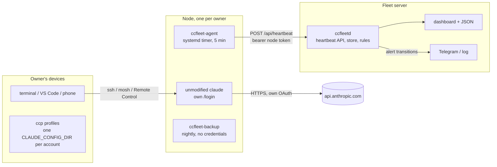
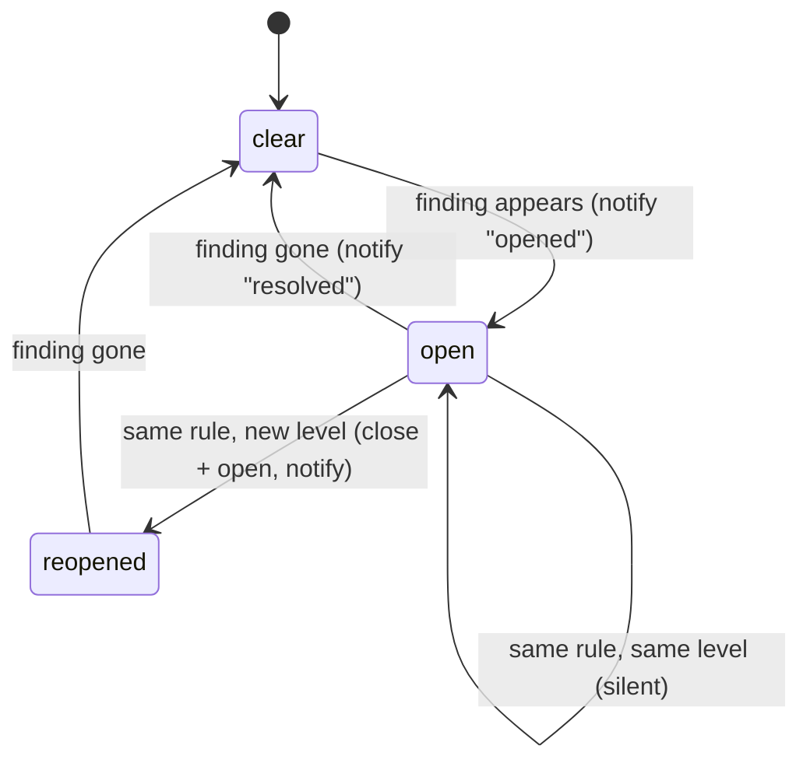

# ccfleet design

## Goal

Let a handful of people each run their own Claude subscription on their own
hosted node, and give one operator visibility over the whole fleet, while
staying inside the shapes Anthropic documents as permitted: the unmodified
Claude Code binary, signed in by its owner, talking to Anthropic directly.

The one-line rule everything derives from: **one owner, one account, one node.**

## Components

### Node

A small VPS in a supported region, one Linux user per owner, one owner per
machine. `node/bootstrap.sh` (root, once) creates the user, installs tmux,
mosh, ufw and unattended-upgrades, hardens SSH to keys only, and enables
lingering so user services run without a login session.
`node/setup-owner.sh` (owner) installs Claude Code with Anthropic's installer,
sets `DISABLE_AUTOUPDATER=1` so upgrades are staged deliberately, installs the
agent, the backup script and the user-level systemd units.

The owner signs in by running `claude` inside tmux and completing `/login`
through Anthropic's browser flow (over SSH the browser shows a code to paste).
Claude Code then owns its credentials file and refreshes tokens itself.

### Agent

`ccfleet_agent/agent.py` is one file with no dependencies so it can be copied
to a node without packaging. Every five minutes it collects:

| Field | Source | Why |
| --- | --- | --- |
| `claude.version`, `claude.path` | `claude --version` | version pinning and drift |
| `credentials.present`, `store` | existence of `~/.claude/.credentials.json` | login missing → owner must `/login` |
| `credentials.mtime`, `expires_at`, `subscription_type` | file stat and two non-secret JSON fields | stale or expired login; token values are never read into the payload |
| `disk`, `mem`, `load`, `uptime_s`, `hostname` | `shutil.disk_usage`, `/proc` | capacity and health |
| `egress.ip`, `egress.source` | first well-formed answer from several public echo services | the node's public identity, alerts on change |
| `remote_control.state` | `systemctl --user is-active claude-remote-control.service` | phone/browser access up or down |
| `tmux_sessions` | `tmux ls` | is anyone working on the node |

The payload is posted with a per-node bearer token; the server stores only the
whitelisted, type-checked subset (`ccfleetd/heartbeat.py`). Network errors and
5xx responses are retried with backoff; 4xx are not.

### Server

`ccfleetd` is standard-library Python: `ThreadingHTTPServer`, `sqlite3`,
`urllib`. Modules:

- `config.py`: immutable settings from `CCFLEET_*` environment variables.
- `store.py`: nodes (token hashes only), heartbeats, alerts; WAL mode; one lock.
- `heartbeat.py`: payload validation and whitelisting.
- `rules.py`: pure functions from (node, latest, previous, now) to findings.
- `monitor.py`: reconciles findings against open alerts, notifies on
  transitions, runs the periodic loop and retention pruning.
- `notify.py`: log and Telegram notifiers; failures are logged, never raised.
- `render.py`: server-rendered dashboard, everything HTML-escaped, no scripts.
- `api.py`: routes, auth, body limits, security headers.
- `cli.py`: `serve`, `check`, `alert-test`, `node …`.

Authentication: agents use `Authorization: Bearer <64-hex token>`; the token
is generated with `secrets.token_hex(32)` and stored as SHA-256. Operators use
HTTP Basic (any user name, admin token as password) or a Bearer admin token.
Comparisons are constant-time. The server binds to loopback by default and
expects a TLS proxy in front.

### Alert lifecycle

Rules are evaluated on every heartbeat for that node and once a minute for all
nodes (which is how `no_heartbeat` fires without any heartbeat arriving).

### Backups

`node/backup.sh` archives the Claude Code state directory nightly, excludes
`.credentials.json`, `debug/` and `cache/`, refuses to keep an archive that
contains the credentials file, keeps the last 14 archives locally and uploads
to an rclone remote when configured. Restoring a node never restores a
credentials file: the owner logs in again.

## Security model

- Nothing in ccfleet ever holds, forwards or logs a token. The agent reads two
  timestamps from the credentials file and its tests assert no token material
  reaches the payload.
- The server stores node token hashes, validates every heartbeat field, caps
  body size, and escapes every value it renders.
- Nodes are single-owner machines: keys-only SSH, firewall, unattended security
  upgrades, user services with `NoNewPrivileges`.
- The agent and backup run as the owner's user; the fleet server runs as an
  unprivileged user (Docker or the provided systemd unit).

## What was left out on purpose

| Feature seen elsewhere | Decision | Reason |
| --- | --- | --- |
| Relay that swaps in a stored OAuth token | out | credential intermediation |
| Header, fingerprint or `metadata.user_id` rewriting | out | misrepresents the client |
| Account pools, failover across accounts, share links, seats | out | pooling shape; you said no sharing, Anthropic's terms say the same |
| Rotating proxies | out | exists only to defeat risk controls |
| Reading usage windows from Anthropic's OAuth endpoints | out | uses the token outside Claude Code; use `/usage` in a session |

## Extending

- New rule: add a function in `rules.py`, register it in `evaluate`, add a
  test in `tests/test_rules.py`, document it in the README table.
- New notifier: implement `Notifier.send`, add it in `build_notifier`.
- New agent field: collect it in `agent.py`, whitelist it in `heartbeat.py`,
  render it in `render.py`.
