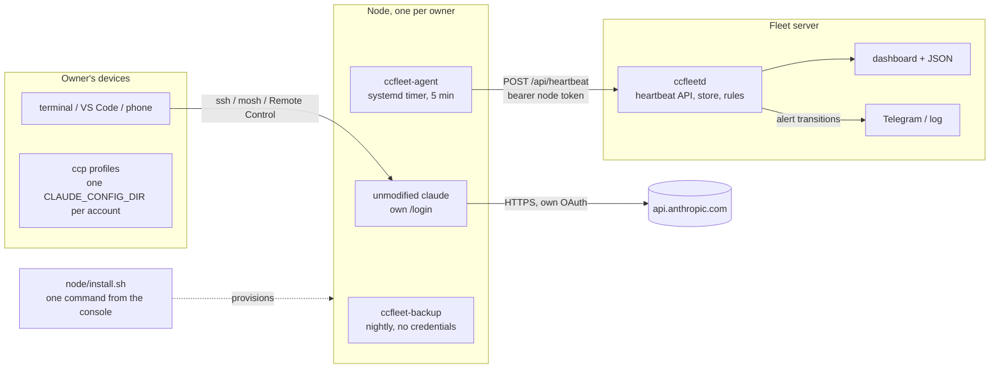
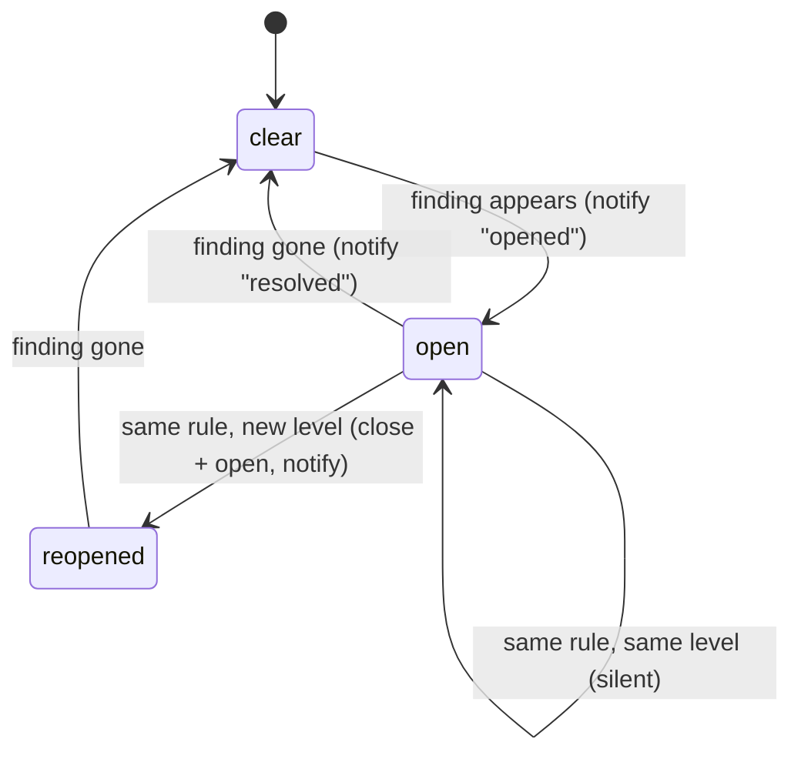

# ccfleet design

## Goal

Let a handful of people each run their own Claude subscription on their own
hosted node, and give one operator visibility over the whole fleet, while
staying inside the shapes Anthropic documents as permitted: the unmodified
Claude Code binary, signed in by its owner, talking to Anthropic directly.

The one-line rule everything derives from: **one owner, one account, one node.**

## Components

### Node

A small VPS in a supported region with its own public address, one Linux user
per owner, one owner per machine. Several nodes may belong to one person, each
with its own subscription; what never happens is two people on one account, or
several accounts behind one endpoint.

`node/install.sh` is the supported path. The console prints it, filled in, when
you add a node, and it takes a blank server to ready-for-sign-in in one command:
packages, the owner account with lingering enabled, SSH and firewall hardening,
Claude Code via Anthropic's installer, the two one-time setup prompts
pre-answered, the agent and its units, the work session, and a first heartbeat.
It refuses to report the machine ready if a service did not come up.

Two things it deliberately does not do:

- **Sign in.** A subscription login must complete through Anthropic's own flow,
  so the owner does that themselves, once.
- **Start Remote Control.** That needs an authenticated session, which does not
  exist until the sign-in. The unit is enabled so it returns after a reboot, and
  the owner starts it once by hand. It cannot usefully retry either: the unit is
  `Type=forking` around a detached tmux session, so systemd sees the launch
  succeed the moment tmux detaches and never learns the session failed to
  authenticate.

The command omits `--ssh-key`, because the console cannot know the owner's
public key. Without that flag the installer skips SSH, firewall and fail2ban
hardening rather than disable password logins on a machine with no key on it.

`node/bootstrap.sh` plus `node/setup-owner.sh` remain for machines managed by
hand. They are **not** equivalent: they install no fail2ban at all, leave the
setup prompts unanswered, leave `agent.env` as a template, do not enable Remote
Control, and neither re-checks the units nor sends a first heartbeat.

#### Two tmux servers, deliberately

The work session `cc` lives on the default tmux server; Remote Control runs on
its own socket, `tmux -L ccfleet-rc`. This is load-bearing rather than tidy. A
tmux server belongs to whichever systemd unit started it, and the default
`KillMode=control-group` kills every process in a unit's control group when it
stops. Sharing one server meant restarting Remote Control destroyed the owner's
work. `ccfleet-shell.service` also carries `KillMode=process` so that stopping
it leaves the session it pre-warmed alone. Attach to Remote Control with
`tmux -L ccfleet-rc attach -t remote-control`.

#### Permission posture

Prompts are on by default. `--bypass-permissions` turns them off for that node,
in the terminal and in sessions driven from claude.ai, and is opt-in because the
owner has passwordless sudo. Tool calls run as the owner rather than as root, but
with prompts off nothing stands between a command and root, because the owner can
take it without being asked again.

It writes two halves, because they are separate mechanisms: `CCFLEET_RC_ARGS` in
an env file the Remote Control unit reads, since remote clients cannot select
bypass for themselves, and `permissions.defaultMode` for sessions the owner
starts by typing `claude`. A later run without the flag undoes both, and restarts a
running Remote Control so the change actually lands.

The two halves are undone differently, because one file is ccfleet's and the
other is not. `remote-control.env` belongs to the installer and is rewritten
whole on every run, so a hand edit to it does not survive.
`~/.claude/settings.json` belongs to the owner, so only the keys a previous run
set are removed, their prior values come back from a snapshot, and a value the
owner has changed since is left alone.

### Agent

`ccfleet_agent/agent.py` is one file with no dependencies so it can be copied
to a node without packaging. Every five minutes it collects:

| Field | Source | Why |
| --- | --- | --- |
| `claude.version`, `claude.path` | `claude --version` | version pinning and drift |
| `credentials.present`, `store` | existence of `~/.claude/.credentials.json` | login missing → owner must `/login` |
| `credentials.mtime`, `expires_at`, `subscription_type` | file stat, plus two non-secret fields parsed from the JSON | stale or expired login; the parsed token values are discarded and never enter the payload |
| `disk`, `mem`, `load`, `uptime_s`, `hostname` | `shutil.disk_usage`, `/proc` | capacity and health |
| `egress.ip`, `egress.source` | first well-formed answer from several public echo services | the node's public identity, alerts on change |
| `remote_control.state` | `systemctl --user is-active claude-remote-control.service` | phone/browser access up or down |
| `tmux_sessions` | `tmux ls` | is anyone working on the node |

The payload is posted with a per-node bearer token; the server stores only the
whitelisted, type-checked subset (`ccfleetd/heartbeat.py`). Network errors and
5xx responses are retried with backoff; 4xx are not.

### Server

`ccfleetd` is standard-library Python: `ThreadingHTTPServer`, `sqlite3`,
`urllib`. Modules:

- `config.py`: immutable settings from `CCFLEET_*` environment variables.
- `store.py`: nodes (token hashes only), heartbeats, alerts; WAL mode; one lock.
- `heartbeat.py`: payload validation and whitelisting.
- `rules.py`: pure functions from (node, latest, previous, now) to findings.
- `monitor.py`: reconciles findings against open alerts, notifies on
  transitions, runs the periodic loop and retention pruning.
- `notify.py`: log and Telegram notifiers; failures are logged, never raised.
- `render.py`: server-rendered dashboard, everything HTML-escaped, no scripts.
- `api.py`: routes, auth, body limits, security headers.
- `cli.py`: `serve`, `check`, `alert-test`, `node …`.

Authentication: agents use `Authorization: Bearer <64-hex token>`; the token
is generated with `secrets.token_hex(32)` and stored as SHA-256. Operators use
HTTP Basic (any user name, admin token as password) or a Bearer admin token.
Comparisons are constant-time. The server binds to loopback by default and
expects a TLS proxy in front.

### Alert lifecycle

Rules are evaluated on every heartbeat for that node and once a minute for all
nodes (which is how `no_heartbeat` fires without any heartbeat arriving).

One rule deliberately waits. `claude_missing` needs two consecutive misses
before it fires, because the installed binary is a symlink that Anthropic's
installer replaces, and a probe landing in that window finds nothing. A node
that genuinely loses Claude Code still alerts one interval later; a node that
never had it alerts immediately, since there is then no earlier heartbeat that
found one.

### Backups

`node/backup.sh` archives the Claude Code state directory nightly, excludes
`.credentials.json`, `debug/` and `cache/`, refuses to keep an archive that
contains the credentials file, keeps the last 14 archives locally and uploads
to an rclone remote when configured. Archive paths are relative to `/`
(`home/<owner>/.claude/...`), so restore with `tar -xzf <archive> -C /`.
Restoring a node never restores a credentials file: the owner logs in again.

## Security model

- No ccfleet component stores or logs a token. The agent parses the credentials
  file in memory to extract the expiry and plan type, discards the rest, and its
  tests assert no token material reaches the payload. The server never receives
  token values. The optional gateway forwards an owner's own requests, OAuth
  header included, in transit only and keeps nothing.
- The server stores node token hashes, validates every heartbeat field, caps
  body size, and escapes every value it renders.
- Nodes are single-owner machines: keys-only SSH, firewall, unattended security
  upgrades, user services with `NoNewPrivileges`.
- The agent and backup run as the owner's user; the fleet server runs as an
  unprivileged user (Docker or the provided systemd unit).
- The owner has passwordless sudo on their own node, which is why
  `--bypass-permissions` is opt-in and says so out loud when used: with prompts
  off nothing stands between a command and root: tool calls run as the owner, and
  the owner can take root without being asked again.
- The console has a single admin token and no per-user accounts, so it is the
  operator's view only. Owners get a node, not the dashboard.

## What was left out on purpose

| Feature seen elsewhere | Decision | Reason |
| --- | --- | --- |
| Relay that swaps in a stored OAuth token | out | credential intermediation |
| Header, fingerprint or `metadata.user_id` rewriting | out | misrepresents the client |
| Account pools, failover across accounts, share links, seats | out | pooling shape; you said no sharing, Anthropic's terms say the same |
| Rotating proxies | out | exists only to defeat risk controls |
| Reading usage windows from Anthropic's OAuth endpoints | out | uses the token outside Claude Code; use `/usage` in a session |

## Extending

- New rule: add a function in `rules.py`, register it in `evaluate`, add a
  test in `tests/test_rules.py`, document it in the README table.
- New notifier: implement `Notifier.send`, add it in `build_notifier`.
- New agent field: collect it in `agent.py`, whitelist it in `heartbeat.py`,
  render it in `render.py`.
