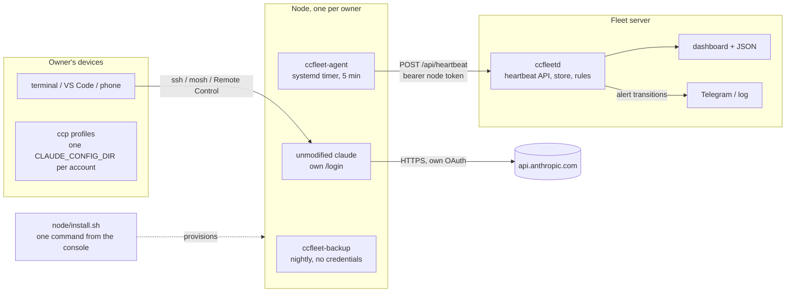
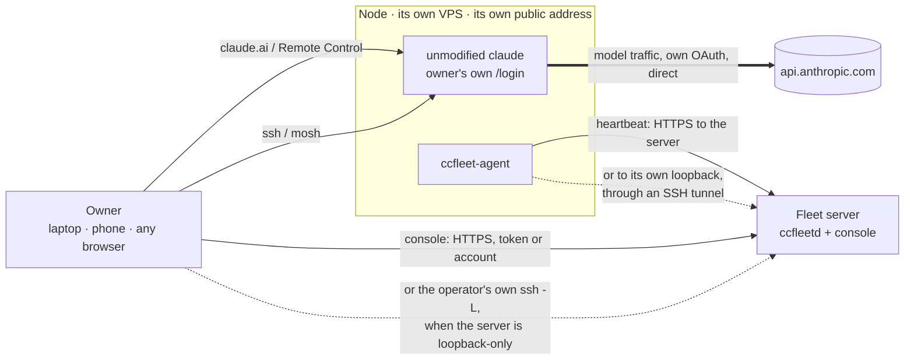
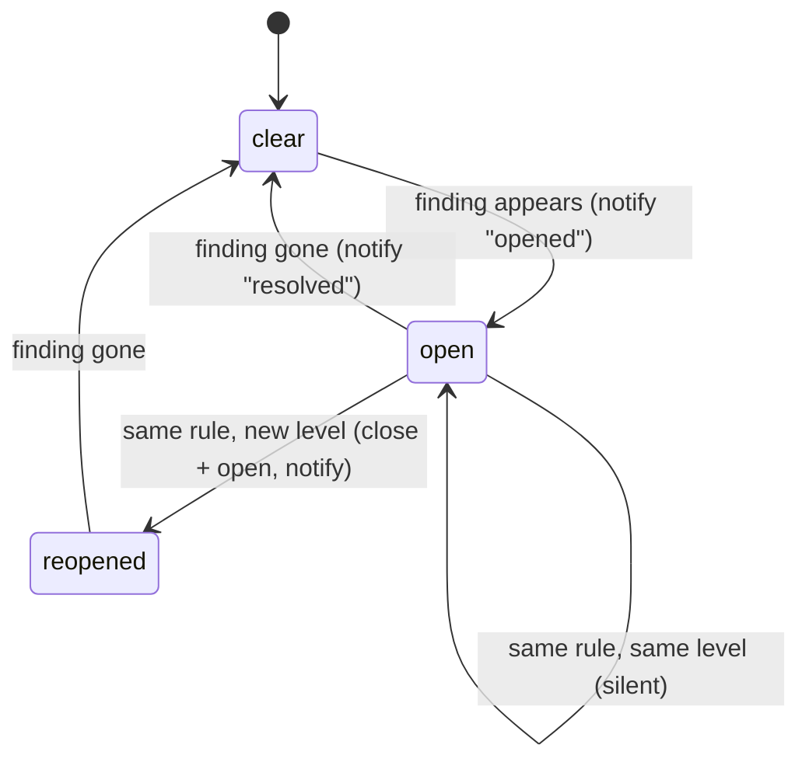
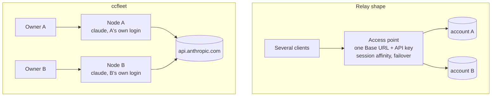

# ccfleet design

## Goal

Let a handful of people each run their own Claude subscription on their own
hosted node, and give one operator visibility over the whole fleet, while
staying inside the shapes Anthropic documents as permitted: the unmodified
Claude Code binary, signed in by its owner, talking to Anthropic directly.

The one-line rule everything derives from: **one owner, one account, one node.**

## Components

### Deployment topology

The default shape: three roles, and only the node sits in a model-request path.
Two supported variants change that, and both are called out below.

By default the agent posts to the server's public HTTPS URL, which is the value
the installer writes into `agent.env`. Where you would rather not expose the
server at all, `ccfleet-tunnel.service` forwards a loopback port on the node to
the server's loopback port and the agent posts to `127.0.0.1` instead, with SSH
providing the encryption. The installer ships that unit but does not enable it;
`docs/tunnel.md` covers the setup and what it costs, namely that the server then
needs a reachable SSH port.

The console follows the same choice. With a public server it is an HTTPS entry,
authenticated by the operator's admin token or by a named account (see
[Console accounts](#console-accounts)). With a loopback-only server nothing outside can reach
ccfleetd at all, so the operator forwards the port themselves with `ssh -L` and
browses `127.0.0.1`.

In this shape nothing belonging to the operator sits between a node and
Anthropic. A node's public address is its own, which is the point of one VPS per
owner: several nodes on one host would share that host's address and stop being
independent.

The one supported exception is the optional pass-through gateway in `gateway/`,
and it is a different situation: it exists for an owner who must keep files on
their laptop and cannot work on a hosted node at all. There Claude Code runs on
the laptop, `ANTHROPIC_BASE_URL` points at the gateway, and the gateway does sit
in the model-request path. It passes the body and Anthropic's required headers
through unchanged, including the owner's own bearer, and stores nothing. Like any
reverse proxy it sets `Host` and adds `X-Forwarded-*`; what keeps it a gateway
rather than a relay is that it never substitutes a credential and never alters
who the client says it is. It is still an operator-owned hop and worth knowing
about before you reach for it.

### Node

A small VPS in a supported region with its own public address, one Linux user
per owner, one owner per machine. Several nodes may belong to one person, each
with its own subscription; what never happens is two people on one account, or
several accounts behind one endpoint.

`node/install.sh` is the supported path. The console prints it, filled in, when
you add a node, and it takes a blank server to ready-for-sign-in in one command:
packages, the owner account with lingering enabled, SSH and firewall hardening,
Claude Code via Anthropic's installer, the two one-time setup prompts
pre-answered, the agent and its units, the work session, and a first heartbeat.
It refuses to report the machine ready if a service did not come up.

Two things it deliberately does not do:

- **Sign in.** A subscription login must complete through Anthropic's own flow,
  so the owner does that themselves, once.
- **Start Remote Control.** That needs an authenticated session, which does not
  exist until the sign-in. The unit is enabled so it returns after a reboot, and
  the owner starts it once by hand. It cannot usefully retry either: the unit is
  `Type=forking` around a detached tmux session, so systemd sees the launch
  succeed the moment tmux detaches and never learns the session failed to
  authenticate.

The command omits `--ssh-key`, because the console cannot know the owner's
public key. Without that flag the installer skips SSH, firewall and fail2ban
hardening rather than disable password logins on a machine with no key on it.

`node/bootstrap.sh` plus `node/setup-owner.sh` remain for machines managed by
hand. They are **not** equivalent: they install no fail2ban at all, leave the
setup prompts unanswered, leave `agent.env` as a template, do not enable Remote
Control, and neither re-checks the units nor sends a first heartbeat.

#### Two tmux servers, deliberately

The work session `cc` lives on the default tmux server; Remote Control runs on
its own socket, `tmux -L ccfleet-rc`. This is load-bearing rather than tidy. A
tmux server belongs to whichever systemd unit started it, and the default
`KillMode=control-group` kills every process in a unit's control group when it
stops. Sharing one server meant restarting Remote Control destroyed the owner's
work. `ccfleet-shell.service` also carries `KillMode=process` so that stopping
it leaves the session it pre-warmed alone. Attach to Remote Control with
`tmux -L ccfleet-rc attach -t remote-control`.

#### Landing in the work session

`node/attach.sh`, appended to the owner's `~/.bashrc`, attaches an interactive
login to `cc` so `ssh` alone puts them where their work is. The guards matter:
it fires only when `TMUX` is empty, `PS1` is set, `$-` contains `i`, stdout is a
terminal, and `CCFLEET_NO_ATTACH` is unset. The terminal check is what protects
scp, rsync and git over ssh, which pipe their output and would be corrupted by a
multiplexer writing into it; `CCFLEET_NO_ATTACH` is the escape hatch for anyone
who wants a plain shell.

Two things it learned the hard way. It does not `exec`, because that turned any
tmux failure into a disconnect rather than a degraded login; `tmux ... && exit`
keeps the same outcome on success while leaving a shell on failure. And it
replaces a `TERM` the node has no terminfo for, since a stock Debian knows none
of ghostty, kitty, wezterm or alacritty, and an unusable `TERM` is exactly what
made tmux refuse. Unset, `dumb` and option-shaped values are replaced too:
`TERM` arrives from the ssh client, so it is not trusted input.

Where the terminal cannot be checked in advance, because `infocmp` is absent,
tmux is simply tried and then retried once with `xterm-256color` rather than
guessing why it failed. If that second attempt fails too, the terminal was never
the problem, so the owner's original `TERM` is handed back rather than leaving a
speculative downgrade in their shell. A terminal the node genuinely cannot use is
replaced permanently, because giving that back would break the fallback shell as
well.

#### Permission posture

Prompts are on by default. `--bypass-permissions` turns them off for that node,
in the terminal and in sessions driven from claude.ai, and is opt-in because the
owner has passwordless sudo. Tool calls run as the owner rather than as root, but
with prompts off nothing stands between a command and root, because the owner can
take it without being asked again.

It writes two halves, because they are separate mechanisms: `CCFLEET_RC_ARGS` in
an env file the Remote Control unit reads, since remote clients cannot select
bypass for themselves, and `permissions.defaultMode` for sessions the owner
starts by typing `claude`. A later run without the flag undoes both, and restarts a
running Remote Control so the change actually lands.

The two halves are undone differently, because one file is ccfleet's and the
other is not. `remote-control.env` belongs to the installer and is rewritten
whole on every run, so a hand edit to it does not survive.
`~/.claude/settings.json` belongs to the owner, so only the keys a previous run
set are removed, their prior values come back from a snapshot, and a value the
owner has changed since is left alone.

### Agent

`ccfleet_agent/agent.py` is one file with no dependencies so it can be copied
to a node without packaging. Every five minutes it collects:

| Field | Source | Why |
| --- | --- | --- |
| `claude.version`, `claude.path` | `claude --version` | version pinning and drift |
| `credentials.present`, `store` | existence of `~/.claude/.credentials.json` | login missing → owner must `/login` |
| `credentials.mtime`, `expires_at`, `subscription_type` | file stat, plus two non-secret fields parsed from the JSON | stale or expired login; the parsed token values are discarded and never enter the payload |
| `disk`, `mem`, `load`, `uptime_s`, `hostname` | `shutil.disk_usage`, `/proc` | capacity and health |
| `egress.ip`, `egress.source` | first well-formed answer from several public echo services | the node's public identity, alerts on change |
| `remote_control.state` | `systemctl --user is-active claude-remote-control.service` | phone/browser access up or down |
| `tmux_sessions` | `tmux ls` | is anyone working on the node |

The payload is posted with a per-node bearer token; the server stores only the
whitelisted, type-checked subset (`ccfleetd/heartbeat.py`). Network errors and
5xx responses are retried with backoff; 4xx are not.

### Server

`ccfleetd` is standard-library Python: `ThreadingHTTPServer`, `sqlite3`,
`urllib`. Modules:

- `config.py`: immutable settings from `CCFLEET_*` environment variables.
- `store.py`: nodes (token hashes only), heartbeats, alerts; WAL mode; one lock.
- `heartbeat.py`: payload validation and whitelisting.
- `rules.py`: pure functions from (node, latest, previous, now) to findings.
- `monitor.py`: reconciles findings against open alerts, notifies on
  transitions, runs the periodic loop and retention pruning.
- `notify.py`: log and Telegram notifiers; failures are logged, never raised.
- `render.py`: server-rendered dashboard, everything HTML-escaped, no scripts.
- `api.py`: routes, auth, body limits, security headers.
- `cli.py`: `serve`, `check`, `alert-test`, `node …`.

Authentication: agents use `Authorization: Bearer <64-hex token>`; the token
is generated with `secrets.token_hex(32)` and stored as SHA-256. Operators use
HTTP Basic (any user name, admin token as password) or a Bearer admin token.
Comparisons are constant-time. The server binds to loopback by default and
expects a TLS proxy in front.

### Alert lifecycle

Rules are evaluated on every heartbeat for that node and once a minute for all
nodes (which is how `no_heartbeat` fires without any heartbeat arriving).

One rule deliberately waits. `claude_missing` needs two consecutive misses
before it fires, because the installed binary is a symlink that Anthropic's
installer replaces, and a probe landing in that window finds nothing. A node
that genuinely loses Claude Code still alerts one interval later; a node that
never had it alerts immediately, since there is then no earlier heartbeat that
found one.

### Backups

`node/backup.sh` archives the Claude Code state directory nightly, excludes
`.credentials.json`, `debug/` and `cache/`, refuses to keep an archive that
contains the credentials file, keeps the last 14 archives locally and uploads
to an rclone remote when configured. Archive paths are relative to `/`
(`home/<owner>/.claude/...`), so restore with `tar -xzf <archive> -C /`.
Restoring a node never restores a credentials file: the owner logs in again.

## Security model

- No ccfleet component stores or logs a token. The agent parses the credentials
  file in memory to extract the expiry and plan type, discards the rest, and its
  tests assert no token material reaches the payload. The server never receives
  token values. The optional gateway forwards an owner's own requests, OAuth
  header included, in transit only and keeps nothing.
- The server stores node token hashes, validates every heartbeat field, caps
  body size, and escapes every value it renders.
- Nodes are single-owner machines: keys-only SSH, firewall, unattended security
  upgrades, user services with `NoNewPrivileges`.
- The agent and backup run as the owner's user; the fleet server runs as an
  unprivileged user (Docker or the provided systemd unit).
- The owner has passwordless sudo on their own node, which is why
  `--bypass-permissions` is opt-in and says so out loud when used: with prompts
  off nothing stands between a command and root: tool calls run as the owner, and
  the owner can take root without being asked again.
- The console takes the operator's admin token, and optionally named accounts.
  An `owner` account sees only the nodes assigned to that owner and is given no
  management controls; an `admin` account is equivalent to the token. Passwords
  are stored as PBKDF2-SHA256 hashes and cannot be recovered, only reset.
  The token is checked before any account, so a login cannot shadow the operator
  by choosing the name `admin`.

## Working on your own machine

The hosted node is not the only shape. Someone who cannot work on a remote
filesystem can run Claude Code locally and still be part of the fleet, and both
halves of that now work.

### The login, and keeping it alive

A laptop has no credentials file to watch: on macOS Claude Code keeps the
credential in the Keychain, and this agent will not read a secret out of it. It
does not need to. `~/.claude.json` carries a non-secret account block on every
platform, and `profileFetchedAt` inside it only advances when a profile fetch
succeeded against the live login, so it reports liveness rather than merely a
time. The agent reads presence, that timestamp and the rate-limit tier, and
nothing else; the email address, full name, account uuid and organisation name in
the same file are never collected.

`token_stale` falls back to that timestamp when there is no file to stat, so a
laptop whose login has gone cold raises the same alert a node does. Version
pinning and `version_mismatch` work unchanged, which is what makes upgrades
happen on your schedule rather than Anthropic's. `laptop/com.ccfleet.agent.plist`
runs the agent every five minutes under launchd, since a Mac has no systemd, and
it deliberately carries no configuration: the agent reads its own env file.

### The traffic, and a stable address

`ANTHROPIC_BASE_URL` alone points Claude Code at a gateway without replacing the
credential, which is the arrangement Anthropic documents. `gateway/` implements
it: a private header to authenticate, that header stripped before forwarding,
the body and Anthropic's required headers passed through unchanged, streaming
preserved, nothing stored. It is a proxy, so it does set `Host` and adds the
usual `X-Forwarded-*`; what it never does is substitute a credential or rewrite
who the client is. The owner gets a consistent egress address without anyone
holding their login.

### What this cannot do, and why

It cannot let two people work under one Pro or Max subscription. For a local
Claude Code to speak as somebody else's personal account there are two
mechanisms and no third: give them that account's credentials, which is sharing,
or have a server hold the token and swap it into their requests, which is
intermediation. A product built around "use the personal account we provide,
locally" needs the second, and that is what this design will not do.

That is a narrower statement than it first sounds, and the difference matters if
you are trying to hand access to a team.

**Seats are the supported way to provide access centrally.** On Team or
Enterprise, an organisation holds the plan and provisions a seat per person, and
each of them signs in as themselves. Nobody shares a credential and nothing
intermediates one, so it sits comfortably inside this design: the seat holder
runs Claude Code locally or on their own node, and the fleet watches it the same
way. If what you want is "we provide the account", this is the shape that does
it, rather than a relay.

**Bedrock and Vertex are a different credential model again**, authenticating
with cloud IAM rather than a subscription. They are out of scope here because
this project is about subscription logins, not because anything is wrong with
them.

So the local path works whenever the credential belongs to the person using it,
whether that is their own subscription or a seat you issued them. You can still
procure, pay for, administer and monitor it. What you give up against a pooled
endpoint is real: no failover when someone hits a limit, no single base URL to
point every tool at, and each person needing their own seat or subscription
rather than a share of yours.

## Console accounts

The console has two kinds of caller.

The **admin token** is the operator's, works over Basic with any user name or as
a Bearer token, and is checked first so nothing can displace it.

**Named accounts** are created with `ccfleetd user add`. An `owner` account is
scoped to one node owner: the dashboard, `/api/nodes` and `/api/alerts` all show
only that owner's nodes, and the management forms are absent. `admin` accounts
behave like the token.

The absent forms are not the control. An owner is handed no CSRF token, and every
write route checks the role, so a hand-built POST is answered **403 rather than
401**: the credentials were fine, the action was not theirs. That distinction is
deliberate, because 401 would invite the owner to go looking for better
credentials.

Passwords use PBKDF2-HMAC-SHA256 at OWASP's iteration floor, salted per user, in
a self-describing format so the cost can be raised later without invalidating
existing hashes. Not argon2 or bcrypt, because this project has no runtime
dependencies and this was not the place to acquire one; the threat is narrow,
since these accounts read a private dashboard and no node token derives from
them. An unknown user name costs the same work as a known one, so response time
does not reveal which accounts exist.

What this does not yet do: there are no sessions, so the browser holds the
credentials for the realm, and there is no self-service password change.

## How this differs from a hosted-account relay

Products exist that host a Claude account per seat on an isolated machine with
its own egress address, and the resemblance to this design is real. The
difference is what sits in front of the account.

In the relay shape a server holds each account's OAuth token, chooses which
account answers a given request, and rewrites the request so it looks as though
it came from that account's own client. That is three separable things: storing
someone's credential, pooling accounts behind one endpoint, and
misrepresenting the client.

ccfleet does none of them, and the reason is not squeamishness. Each of the
three is the thing that makes a fleet look like account sharing rather than
several people each using their own subscription.

| | Relay / pooled access point | ccfleet |
| --- | --- | --- |
| What answers a request | whichever account the pool picks | the one node you are working on |
| Who holds the OAuth token | the relay | Claude Code on the node, as always |
| Request headers and client identity | rewritten to match the captured account | not rewritten; the real client stays the real client |
| Adding a second person | another seat behind the same endpoint | another machine with their own login |
| What the management plane can see | the traffic | facts about nodes, never a request |
| Failover between accounts | a feature | absent on purpose |

The honest summary: the hosting idea is the same, one account per isolated
machine with its own address. Everything about what sits in front of it is
opposite. A pooled endpoint is the shape this project exists not to be.

## What was left out on purpose

| Feature seen elsewhere | Decision | Reason |
| --- | --- | --- |
| Relay that swaps in a stored OAuth token | out | credential intermediation |
| Header, fingerprint or `metadata.user_id` rewriting | out | misrepresents the client |
| Account pools, failover across accounts, share links, seats | out | pooling shape; you said no sharing, Anthropic's terms say the same |
| Rotating proxies | out | exists only to defeat risk controls |
| Reading usage windows from Anthropic's OAuth endpoints | out | uses the token outside Claude Code; use `/usage` in a session |

## Extending

- New rule: add a function in `rules.py`, register it in `evaluate`, add a
  test in `tests/test_rules.py`, document it in the README table.
- New notifier: implement `Notifier.send`, add it in `build_notifier`.
- New agent field: collect it in `agent.py`, whitelist it in `heartbeat.py`,
  render it in `render.py`.
