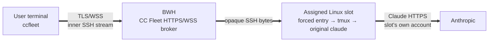
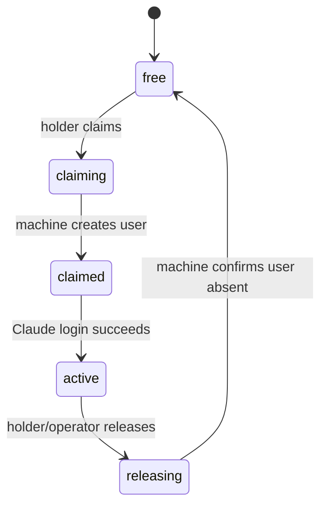

# CC Fleet design

This document describes the default hosted-terminal path. The separately gated
local-project relay has different execution and privacy boundaries, documented
in [local-relay.md](local-relay.md); it is not an automatic customer migration.

## Product invariant

CC Fleet provides remote Claude Code slots without an account pool:

> one holder → one slot → one Claude account

A holder may pair several personal computers with that slot. Pairing authorizes
transport to the slot; it never exports the Claude credential. Every model
request is created by the original Claude Code process running in the assigned
slot and goes from that slot to Anthropic.

## Data path


```mermaid
flowchart LR
  U[User terminal<br/>ccfleet]
  B[BWH<br/>CC Fleet HTTPS/WSS broker]
  S[Assigned Linux slot<br/>forced entry → tmux → original claude]
  A[Anthropic]

  U == TLS/WSS<br/>inner SSH stream ==> B
  B == opaque SSH bytes ==> S
  S == Claude HTTPS<br/>slot's own account ==> A
```

The local command is a terminal transport, not a second Claude client. The
outer layer is TLS/WSS between the computer and BWH. Inside it, OpenSSH is
authenticated and encrypted between the computer and the slot. BWH selects the
operator-configured node endpoint and relays bytes; it does not terminate SSH
and therefore cannot inspect prompts or terminal output.

The slot host key is returned at pairing and written to a device-specific
`known_hosts` file. OpenSSH uses `StrictHostKeyChecking=yes`, so a later machine
or routing substitution fails closed.

## Pairing

1. A signed-in holder requests a pairing code for a held, active slot.
2. The server creates a high-entropy `ccf_pair_…` value, stores only its
   SHA-256 hash, and expires it after ten minutes.
3. `ccfleet login` generates a local Ed25519 key pair and exchanges the code
   and public key at `/api/cli/register`.
4. Registration consumes the pairing code atomically and returns:
   - a random `ccf_dev_…` access token;
   - the assigned slot id, display name and Unix user;
   - the public WSS endpoint;
   - the slot machine's SSH host key.
5. The server stores only the device-token hash, public key, label,
   fingerprint and timestamps. The private key remains on the paired computer.
6. Machine desired state contains public keys only. The agent installs them in
   `/etc/ccfleet/authorized_keys/<unix-user>`, outside the holder-writable home.

A slot supports at most ten paired devices. Pairing codes are single-use.
Removing a device deletes its server row, closes an already-open broker stream
and removes its public key at the next machine convergence. Releasing,
unholding or removing the slot deletes all pairings and devices immediately on
the server; releasing sends an empty key set before a wipe attempt.

## Connection

`ccfleet` chooses the active local profile and starts OpenSSH with a
`ProxyCommand` that invokes `ccfleet proxy`. The proxy performs an authenticated
WebSocket upgrade to `/api/cli/connect` and carries binary SSH bytes.

The broker:

- hashes and resolves the device token;
- verifies the device, slot, holder, slot state, node state and fixed endpoint;
- never accepts a host or port from the client;
- opens one TCP connection to the configured node endpoint;
- forwards complete, bounded, unfragmented binary WebSocket frames;
- handles ping, pong and close frames;
- stops both directions when either side closes.

The client asks OpenSSH for a PTY and authenticates as the assigned slot Unix
user. Each installed key has these restrictions:

```text
command="/usr/local/lib/ccfleet/slot-entry.sh",no-agent-forwarding,
no-port-forwarding,no-X11-forwarding,no-user-rc
```

The sshd `Match Group ccfleet-slots` block independently sets the same
`ForceCommand`, disables forwarding and reads keys only from the root-controlled
directory. A slot can use shell tools through Claude Code but cannot replace
its own SSH authorization or escape device revocation.

sshd reads an `AuthorizedKeysFile` using the target account's credentials, so
the path is traversable/readable (`/etc/ccfleet` 0711, key directory 0755,
public-key files 0644) but root-owned and never holder-writable. The adjacent
machine token is atomically replaced as a root-only 0600 file.

Debian treats the shadow marker created by `adduser --disabled-password` as a
locked account and may reject it before public-key authentication. Provisioning
therefore assigns a random, discarded password hash; the slot Match block still
sets both `PasswordAuthentication no` and `KbdInteractiveAuthentication no`.

`slot-entry.sh` rejects non-interactive sessions, normalizes unsupported
`TERM` values, and accepts only a fixed
`ccfleet-session ACTION NAME MODE MODEL EFFORT` request from the forced key.
Names, modes, model syntax and effort levels are validated; arbitrary SSH
commands remain impossible. The default changes to `~/workspace` and executes:

```bash
tmux new-session -A -s ccfleet -c "$HOME/workspace" \
  "$HOME/.local/bin/claude" --dangerously-skip-permissions --model opus --effort max
```

This gives the original Claude Code interface while preventing the transport
key from becoming a general-purpose SSH key. Shell commands remain available
through Claude Code's ordinary tool execution inside the slot.

The hosted session deliberately bypasses Claude Code permission prompts. This
does not grant sudo or cross the slot's Linux-user boundary, but it does allow
Claude to act without confirmation on every file and network capability the
slot user already has.

Users may create named tmux sessions with a supported permission mode, a safe
model token and an effort of `low`, `medium`, `high`, `xhigh`, `max`, or
`ultracode`. The original Claude interface's `/model` and `/effort` controls can
change a running conversation. `open` is idempotent for reconnect, `new` refuses
an existing name, and `restart` explicitly ends the current Claude process.
Every action remains inside the forced entrypoint. Four-field requests from the
previous client remain valid and use the slot defaults.

## Reconnection

The tmux session belongs to the slot, not the network connection. On an SSH
transport failure, the local client retries for up to ten minutes with bounded
backoff. A new connection attaches to the same `ccfleet` session. Intentional
Claude exit returns normally and is not turned into a reconnect loop.

## Trust boundaries

### User computer

Stores, mode `0600`:

- one private SSH key per paired profile;
- the pinned host key;
- the CC Fleet device access token and slot metadata.

It stores no Claude OAuth credential and does not set `ANTHROPIC_BASE_URL`,
`ANTHROPIC_AUTH_TOKEN`, `ANTHROPIC_API_KEY` or `CLAUDE_CODE_OAUTH_TOKEN`.

### BWH broker

Can observe that a device connected, which slot it resolved to and the traffic
timing/volume available to any relay. It stores device metadata and token
hashes. Because SSH is the inner layer, it cannot read the terminal content.

BWH is still trusted for availability and routing: it can refuse a connection
or point a slot at the wrong endpoint. Host-key pinning turns endpoint
substitution into a visible connection failure rather than silently exposing a
session.

### Slot machine

Intentionally decrypts the terminal because it runs Claude Code. It holds the
Claude credential, project files and tool processes. The machine administrator
has root and can technically inspect them; no transport design can hide data
from the computer that executes it.

Linux users isolate ordinary slot processes from one another, but they are not
a boundary against root or a kernel compromise.

### Anthropic

Receives the ordinary traffic emitted by the original Claude Code process on
the slot under the account signed in there. Network, host and application
metadata generated by Claude Code are therefore the slot's. The user's browser
is still involved when the user completes Anthropic's login flow, and Anthropic
handles that browser interaction under its own policies.

## Control plane

Machine agents post authenticated heartbeats and request desired state. The
server responds with per-slot lifecycle, version, sign-in operations and the
public keys of currently paired devices. Node bearer tokens and device tokens
are stored as SHA-256 hashes.

The customer website provides:

- Google sign-in to CC Fleet;
- claim, release, rename and account-change lifecycle;
- the Claude sign-in link/code exchange;
- CLI pairing and per-device revocation;
- quota and health summaries;
- public product, privacy, terms and status pages.

The operator console manages accounts, allowances, payments, nodes, slots and
alerts. It does not expose Claude credentials or pairing secrets.

## Slot lifecycle


```mermaid
stateDiagram-v2
  [*] --> free
  free --> claiming: holder claims
  claiming --> claimed: machine creates user
  claimed --> active: Claude login succeeds
  active --> releasing: holder/operator releases
  releasing --> free: machine confirms user absent
```

- Pairing is allowed only in `active`.
- A slot's accepted Claude account fingerprint is bound after first login.
- “Sign in again” keeps that fingerprint; “Change account” deliberately
  replaces it and is rate-limited.
- Releasing closes device transports and revokes keys before the asynchronous
  wipe completes, including when that wipe fails and must retry.
- A free slot has no holder, pairings, devices or account binding.

## Persistence and schema

Relevant tables:

- `nodes`: fixed BWH-reachable access host, port and SSH host key;
- `slots`: holder, Unix user, lifecycle, display name and Claude-account
  binding;
- `cli_pairings`: pairing-token hash, holder, slot and expiry;
- `cli_devices`: token hash, public key, fingerprint, label and timestamps;
- `heartbeats`, `alerts`, `slot_logins`, `claude_updates`, accounts and payment
  records for the existing control plane.

SQLite writes use the store transaction lock. Pairing consumption and device
creation occur in one write transaction, which prevents replay races.

## Non-goals

- No account pool or automatic account selection.
- No model API compatible endpoint for customers.
- No Claude credential on BWH or the local computer.
- No local-project mount or implicit background synchronization.
- No customer-visible SSH workflow.
- No promise that a slot is private from its root administrator.

Legacy owner-node, Remote Control and pass-through gateway code remains for
owner deployments. Hosted customer slots disable the old Remote Control unit;
none of it is presented as an alternative product mode.
